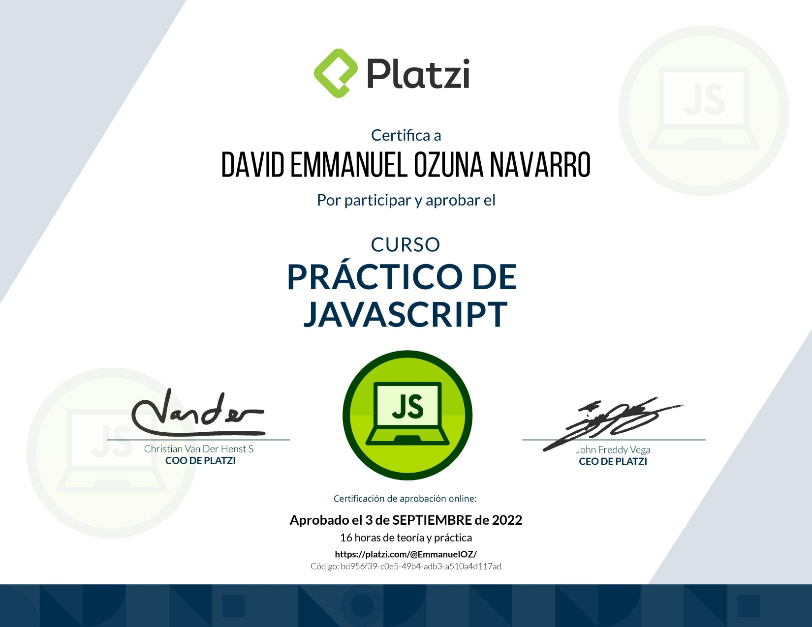

# platzi-cursoPractica-javascript

Es el repositorio que usare para realizar el cursos JavaScript de platzi

...

## Taller #1: figuras geométricas

- Primer paso: Definir las formulas
- Segundo paso: Implementar las formulas en JavaScript
- Tercer paso: crear funciones
- Cuarto paso: integrar JS con HTML

## Taller #2: porcentajes y descuentos

- Primer paso: definir las fórmulas
- Segundo paso: implementar la fórmulas en JavaScript 
- Tercer paso: crear funciones
- Cuarto paso: integrar JS con HTML

## Taller #3: promedio, mediana y moda

- Primer paso: definir las fórmulas
- Segundo paso: implementar la fórmulas en JavaScript 
- Tercer paso: crear funciones
- Cuarto paso: integrar JS con HTML
# curso-practico-javascript

**Curso Terminado**

**Pagina desplegado desde la rama Test [aquí](https://emmanueloz.github.io/platzi-cursoPractica-javascript/index.html)**
